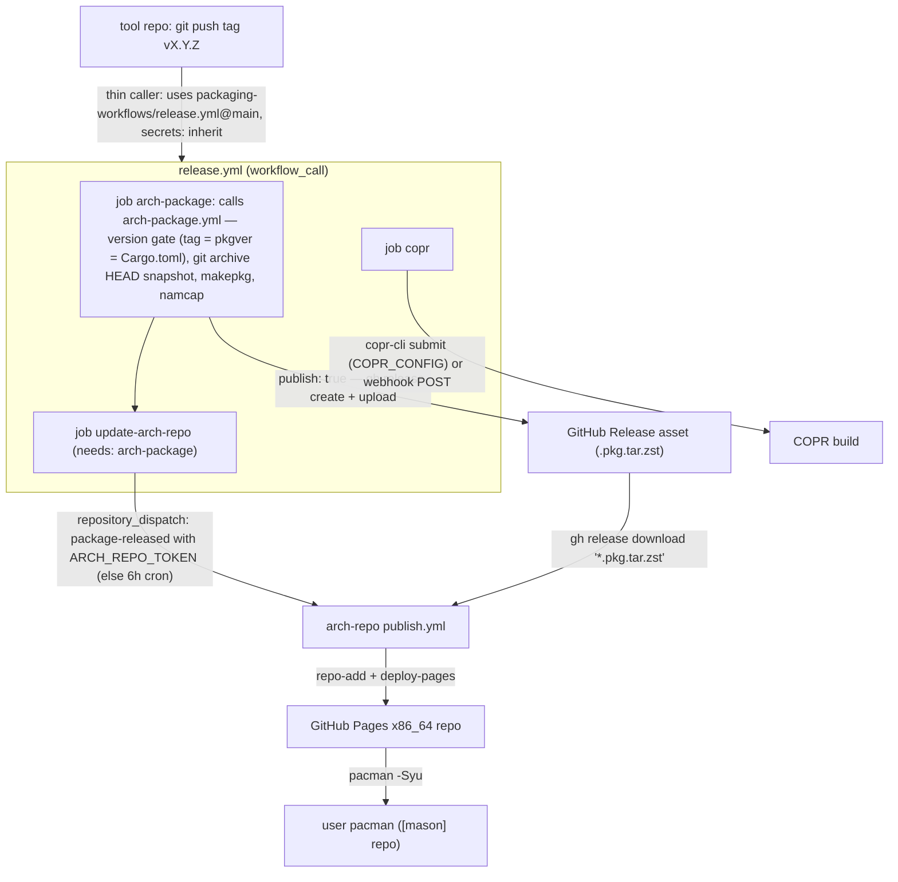

# packaging-workflows

Reusable GitHub Actions workflows shared by all MasonRhodesDev projects. One
place to fix CI for every repo.

## Workflows

| Workflow | Purpose | Key inputs |
|---|---|---|
| `rust-ci.yml` | fmt → clippy → test → build in an `archlinux` container | `pacman-deps`, `cargo-flags` |
| `arch-package.yml` | `makepkg` from a HEAD snapshot + namcap; optionally uploads to the tag's GitHub Release | `pkgbuild-dir`, `publish` |
| `rpm-check.yml` | SRPM from HEAD → `rpmbuild --rebuild` (runs `%check`) → gating rpmlint in a `fedora` container | `spec-name` |
| `release.yml` | On tag: Arch package → Release asset, POST COPR webhook, dispatch arch-repo republish | `pkgbuild-dir`; secrets `COPR_CONFIG` (copr-cli token file; SRPM built+submitted in CI, expires ~180d), `COPR_WEBHOOK_URL` (fallback), `ARCH_REPO_TOKEN` (all optional) |
| `security.yml` | cargo-deny (advisories/licenses/bans/sources) | — |

## Per-repo contract

Every packaged repo provides:

- `packaging/PKGBUILD` — `source=("$pkgname-$pkgver.tar.gz::https://github.com/MasonRhodesDev/$pkgname/archive/v$pkgver.tar.gz")`, `sha256sums=('SKIP')`. CI drops a `git archive` snapshot next to it so makepkg never downloads during PR builds.
- `packaging/<name>.spec` + `packaging/<name>.rpmlintrc` + `packaging/build-srpm.sh` — hyprstate-style vendored-cargo SRPM build with the four-way version gate (spec = Cargo.toml = Cargo.lock = PKGBUILD).
- `dist/` — canonical systemd units and other payload files with **packaged** paths (`/usr/bin`, never `%h/.local/bin`).
- `.copr/Makefile` — `make srpm` entry point so COPR rebuilds on its own GitHub webhook.
- Thin caller workflows in `.github/workflows/` (see below).

## Example callers

```yaml
# .github/workflows/ci.yml
name: CI
on: { push: { branches: [main] }, pull_request: }
jobs:
  ci:
    uses: MasonRhodesDev/packaging-workflows/.github/workflows/rust-ci.yml@main
    with:
      pacman-deps: pipewire alsa-lib   # if needed
```

```yaml
# .github/workflows/release.yml
name: Release
on: { push: { tags: ['v*'] } }
permissions: { contents: write }
jobs:
  release:
    uses: MasonRhodesDev/packaging-workflows/.github/workflows/release.yml@main
    secrets: inherit
```

## Release flow (any repo)



1. Bump version (Cargo.toml + spec + PKGBUILD `pkgver`) — one commit.
2. `git tag vX.Y.Z && git push --tags`
3. CI builds and attaches the `.pkg.tar.zst`, COPR rebuilds off its webhook,
   and [arch-repo](https://github.com/MasonRhodesDev/arch-repo) republishes the
   pacman database (immediately with `ARCH_REPO_TOKEN`, otherwise on schedule).
