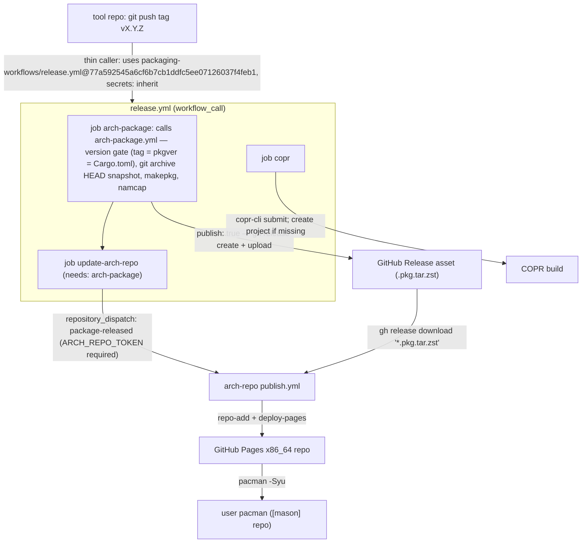

# packaging-workflows

Reusable GitHub Actions workflows shared by all MasonRhodesDev projects. One
place to fix CI for every repo.

## Workflows

| Workflow | Purpose | Key inputs |
|---|---|---|
| `rust-ci.yml` | fmt → clippy → test → build in an `archlinux` container | `pacman-deps`, `cargo-flags` |
| `arch-package.yml` | `makepkg` + namcap; PR builds snapshot this repo unless `skip-head-snapshot` | `pkgbuild-dir`, `publish`, `skip-head-snapshot` |
| `rpm-check.yml` | SRPM from HEAD → `rpmbuild --rebuild` (runs `%check`) → gating rpmlint in a `fedora` container | `spec-name` |
| `release.yml` | On tag: Arch + RPM gates → GitHub Release → COPR submit → arch-repo dispatch. COPR and `ARCH_REPO_TOKEN` are required when `rpm: true`. Missing secrets fail the release. COPR projects are created from CI if absent. | `pkgbuild-dir`, `spec-name`, `rpm`, `copr-project`, `copr-enable-net`; secrets `COPR_CONFIG` (required for rpm repos; token expires ~180d), `COPR_WEBHOOK_URL` (fallback), `ARCH_REPO_TOKEN` (required) |
| `security.yml` | cargo-deny (advisories/licenses/bans/sources) | — |
| `crates-publish.yml` | `cargo publish --locked` on a `v*` tag | secret `CARGO_REGISTRY_TOKEN` (required; org Actions secret) |

## Per-repo contract

Every packaged repo provides:

- `packaging/PKGBUILD` — `source=("$pkgname-$pkgver.tar.gz::https://github.com/MasonRhodesDev/$pkgname/archive/v$pkgver.tar.gz")` with a real `sha256sums` of that archive (not `SKIP`; CI rejects `SKIP`). CI drops a `git archive` snapshot next to it so makepkg never downloads during PR builds.
- `packaging/<name>.spec` + `packaging/<name>.rpmlintrc` + `packaging/build-srpm.sh` — hyprstate-style vendored-cargo SRPM build with the four-way version gate (spec = Cargo.toml = Cargo.lock = PKGBUILD).
- `dist/` — canonical systemd units and other payload files with **packaged** paths (`/usr/bin`, never `%h/.local/bin`).
- `.copr/Makefile` — `make srpm` entry point so COPR rebuilds on its own GitHub webhook.
- Thin caller workflows in `.github/workflows/` (see below).

## Example callers

```yaml
# .github/workflows/ci.yml
name: CI
on: { push: { branches: [main] }, pull_request: }
jobs:
  ci:
    uses: MasonRhodesDev/packaging-workflows/.github/workflows/rust-ci.yml@77a592545a6cf6b7cb1ddfc5ee07126037f4feb1
    with:
      pacman-deps: pipewire alsa-lib   # if needed
```

```yaml
# .github/workflows/release.yml
name: Release
on: { push: { tags: ['v*'] } }
permissions: { contents: write }
jobs:
  release:
    uses: MasonRhodesDev/packaging-workflows/.github/workflows/release.yml@77a592545a6cf6b7cb1ddfc5ee07126037f4feb1
    secrets: inherit
```

## Release flow (any repo)


```mermaid
flowchart TD
    tag["tool repo: git push tag vX.Y.Z"]

    subgraph releasewf ["release.yml (workflow_call)"]
        archpkg["job arch-package: calls arch-package.yml — version gate (tag = pkgver = Cargo.toml), git archive HEAD snapshot, makepkg, namcap"]
        coprjob["job copr"]
        update["job update-arch-repo (needs: arch-package)"]
        archpkg --> update
    end

    tag -->|"thin caller: uses packaging-workflows/release.yml@77a592545a6cf6b7cb1ddfc5ee07126037f4feb1, secrets: inherit"| releasewf
    archpkg -->|"publish: true — gh release create + upload"| asset["GitHub Release asset (.pkg.tar.zst)"]
    coprjob -->|"copr-cli submit; create project if missing"| coprbuild["COPR build"]
    update -->|"repository_dispatch: package-released (ARCH_REPO_TOKEN required)"| publish["arch-repo publish.yml"]
    asset -->|"gh release download '*.pkg.tar.zst'"| publish
    publish -->|"repo-add + deploy-pages"| pages["GitHub Pages x86_64 repo"]
    pages -->|"pacman -Syu"| pacuser["user pacman ([mason] repo)"]
```

1. Bump version (Cargo.toml + spec + PKGBUILD `pkgver`) — one commit.
2. `git tag vX.Y.Z && git push --tags`
3. CI attaches the `.pkg.tar.zst`, submits the SRPM to COPR (creating the
   project if needed), and [arch-repo](https://github.com/MasonRhodesDev/arch-repo)
   republishes `[mason]`. Both channels are required; do not `copr-cli` from a
   laptop. Org secrets: `COPR_CONFIG`, `ARCH_REPO_TOKEN`.

Crate libraries (hypr-paths, hypr-logind, hypr-ipc) publish to crates.io from
CI, not a laptop. Org secret: `CARGO_REGISTRY_TOKEN`. Caller:

```yaml
# .github/workflows/release.yml
name: Release
on: { push: { tags: ['v*'] } }
jobs:
  crates:
    uses: MasonRhodesDev/packaging-workflows/.github/workflows/crates-publish.yml@PIN
    secrets:
      CARGO_REGISTRY_TOKEN: ${{ secrets.CARGO_REGISTRY_TOKEN }}
```
